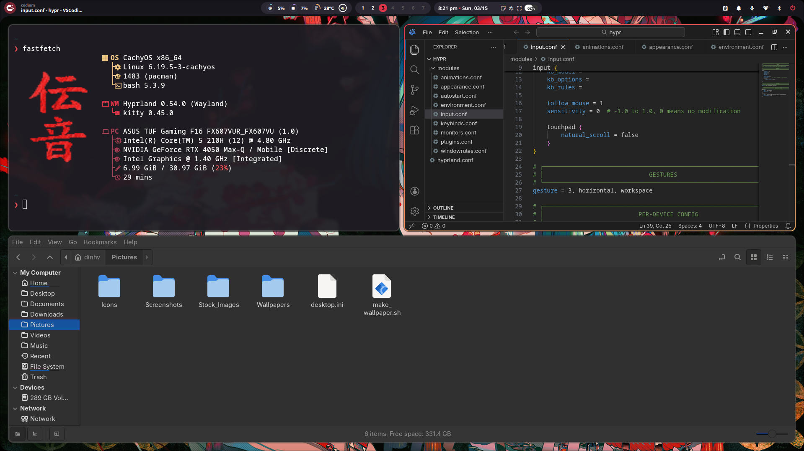
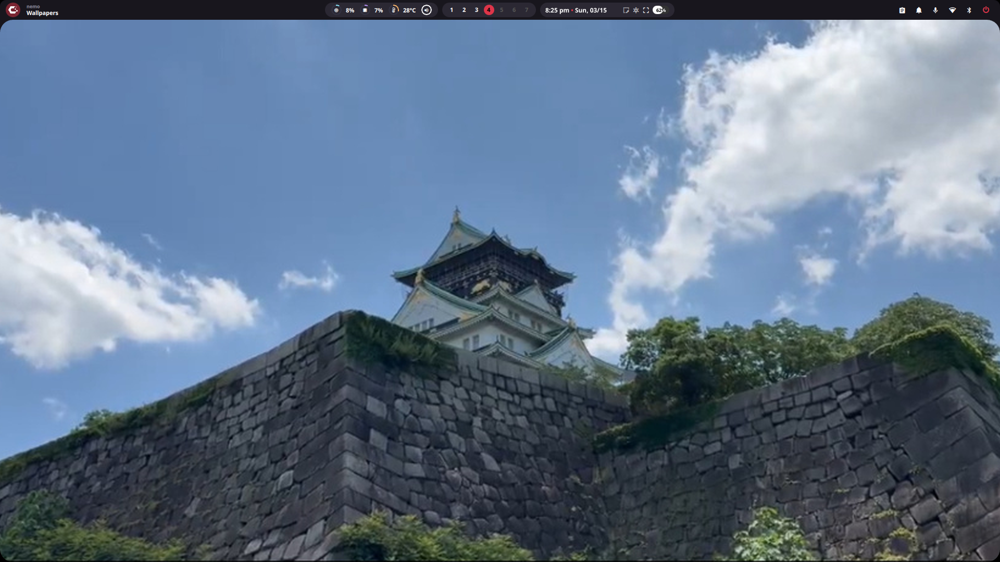
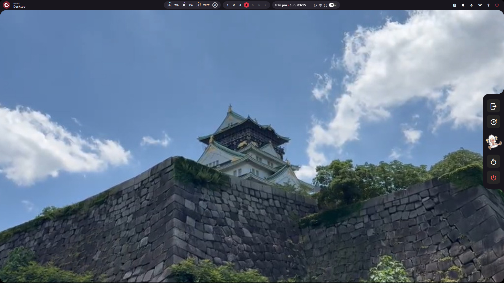
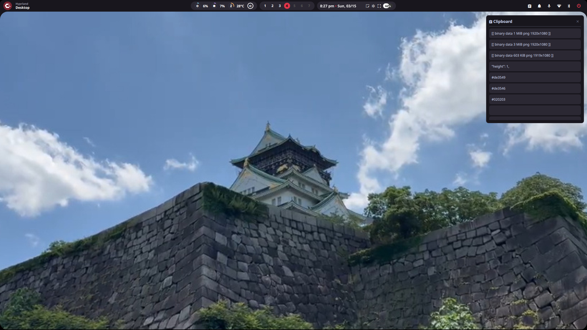
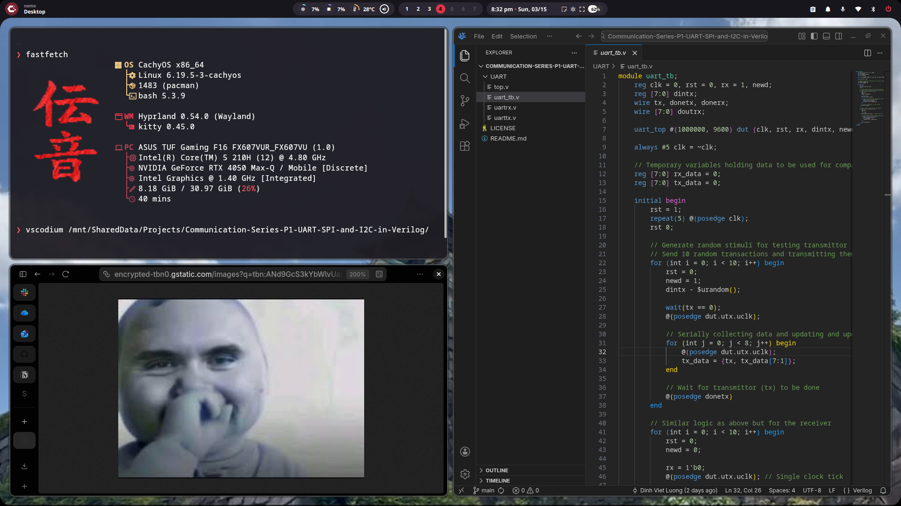
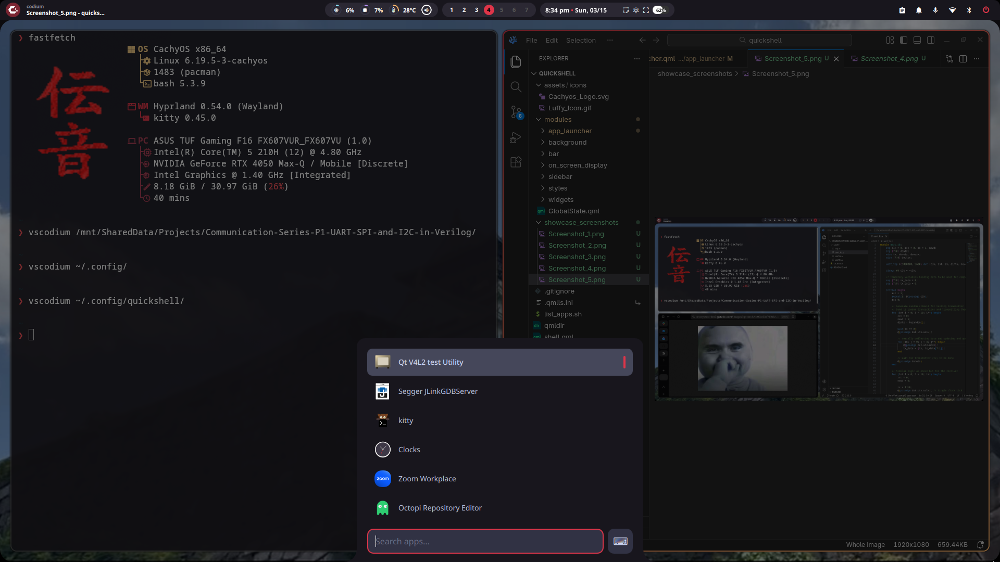

# Thinkerers Desktop Bar

Welcome to my personnal hobby project **Thinkerers Desktop Bar**! This is a highly customizable, aesthetically pleasing, and feature-rich shell environment built from the ground up using the [Quickshell](https://outfoxxed.github.io/quickshell/) framework. 

Designed specifically for modern Wayland compositors like Hyprland, this project aims to provide a cohesive and elegant desktop experience. It replaces standard, static status bars with a fully interactive suite of QML-based widgets. From a dynamic top bar and an integrated application launcher to interactive on-screen displays (OSD), system monitors, and quick settings, this setup bridges the gap between power-user functionality and a beautiful, clean rice.

## Showcase

Here is a look at the desktop bar and its various modules in action:


*General desktop layout with the top bar, terminal, and code editor.*


*Clean desktop view highlighting the transparent top bar.*


*Sidebar and Power Menu overlay.*


*Integrated clipboard history popup.*


*Active window usage alongside floating video and code.*


*The custom application launcher module.*

## File Structure

The project is heavily modularized using QML, keeping individual components separated and easy to manage:

```
├── assets
│   └── icons
│       ├── Cachyos_Logo.svg
│       └── Luffy_Icon.gif
├── list_apps.sh
├── modules
│   ├── app_launcher
│   │   └── AppLauncher.qml
│   ├── background
│   │   ├── CornerFiller.qml
│   │   └── Corners.qml
│   ├── bar
│   │   ├── Bar.qml
│   │   ├── center_side
│   │   │   ├── Clock_Pill.qml
│   │   │   ├── components
│   │   │   │   ├── Battery.qml
│   │   │   │   ├── Brightness.qml
│   │   │   │   ├── Clock.qml
│   │   │   │   ├── Color_Picker.qml
│   │   │   │   ├── CPU.qml
│   │   │   │   ├── Media.qml
│   │   │   │   ├── Memory.qml
│   │   │   │   ├── Screenshot.qml
│   │   │   │   ├── Temperature.qml
│   │   │   │   └── Volume.qml
│   │   │   ├── SystemData.qml
│   │   │   └── Workspaces.qml
│   │   ├── left_side
│   │   │   ├── ActiveWindow.qml
│   │   │   └── Logo.qml
│   │   └── right_side
│   │       ├── ClipboardPopup.qml
│   │       ├── NotificationPopup.qml
│   │       └── QuickSettings.qml
│   ├── GlobalState.qml
│   ├── on_screen_display
│   │   └── OSD.qml
│   ├── sidebar
│   │   └── PowerMenu.qml
│   ├── styles
│   │   └── Colors.qml
│   └── widgets
│       └── Stats.qml
├── qmldir
└── shell.qml
```
## Tools Used

This setup relies on a few excellent open-source tools and utilities to function fully:
    1. Hyprland - The Wayland compositor
    2. Quickshell - The core Wayland shell framework
    3. rog-control-center - For ASUS ROG specific hardware controls
    4. org-gnome-clock - Time and date utilities
    5. swappy - Wayland native snapshot and editing tool
    6. nm-connection-editor - Network management UI
    7. blueman-manager - Bluetooth management UI

## Inspiration & Credits

A huge thank you to the creators of the following dotfiles, which provided massive inspiration and foundational ideas for this project:
    * caelestia-dot shell
    * end-4 dots

## Contributing

Since this a personal project for my own use, I will be updating it on my own.
However, if you want to make your own version, please feel free to take my code for your own use !
